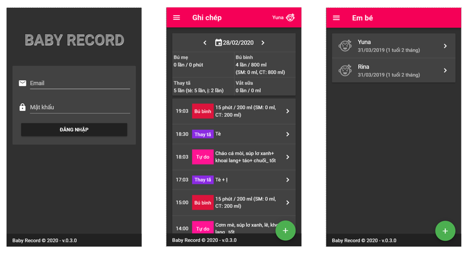

# Baby record - Easy record your baby activities

### Architecture

* Backend: CakePHP 3.7
* Frontend: Nuxt 2

### Main branches

1. `master`     
    Contains source code which is ready to release
1. `deployment`
    Contains deployment script
1. `doc`
    Contains documentation

### Installation

1. Clone repository

1. Create empty database with name `baby-record` and `cabo-record-test`

1. Configuration backend

    Copy `/{path-to-source}/backend/config/.env.default` to `/{path-to-source}/backend/config/.env` and edit value in it if neccessary.

1. Install backend dependencies:

    ~~~
    $ cd /{path-to-source}/backend
    $ composer install
    ~~~

1. Install frontend dependencies:

    ~~~
    $ cd /{path-to-source}/frontend
    $ npm install
    ~~~

### Deployment

Refer `README.md` in branch `deployment`.

### Screenshots

